# Лекція 2
--------

## Основні підходи теорії оцінювання
--------
1. МНК (ЗМНК - зважений метод найменших квадратів)
2. Марківська оцінка
3. Метод максимальної правдоподібності
4. Метод максимума апостеріорної ймовірності
5. Байєсівські оцінки
6. Оцінки з мінімальною середньоквадратичною похибкою
7. minmax оцінки (гарантовані оцінки)

##  Метод найменших квадратів
--------
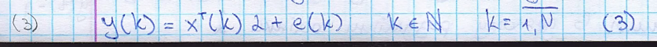
y та e мають розмірність N
 альфа має розмірність р
 Х має розмірність Nxp
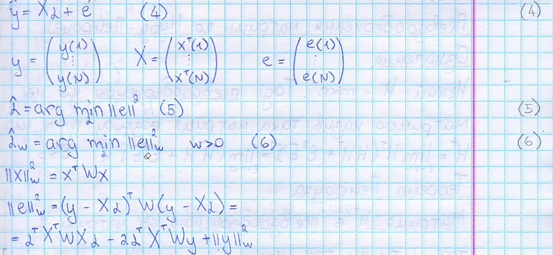
w - позитивно визначена матриця
ЗМНК:
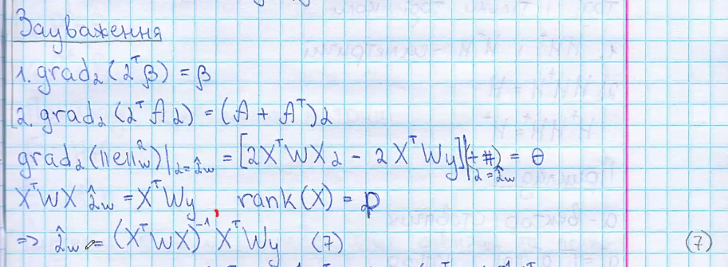
Похибка оцінювання оцінки ЗМНК:
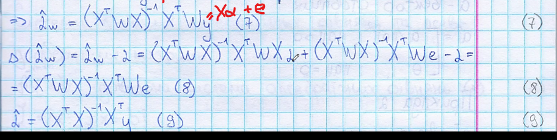
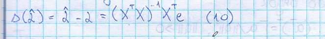

## Означення
## Псевдобернення матриць по Муру-Пенроузу
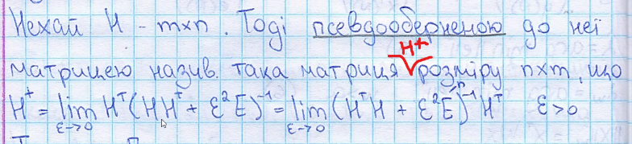

## Теорема Пенроуза

## Приклад 1
Нехай а - вектор-стовпчик, тоді:
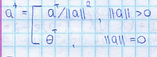

## Приклад 2
Нехай а - вектор-рядок, тоді чи будуть виконуватися теорема Пенроуза?

## Властивості псевдооберненної матриці:
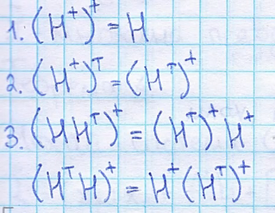

## Означення
## Проекційна матриця
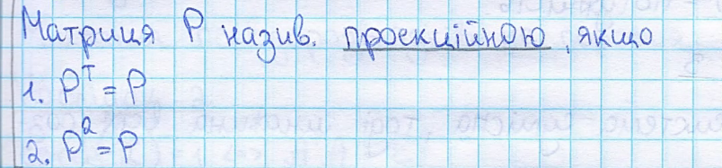

## Приклади проекційної матриці

## Системи алгебраїчних рівнянь та псевдооберненних матриць
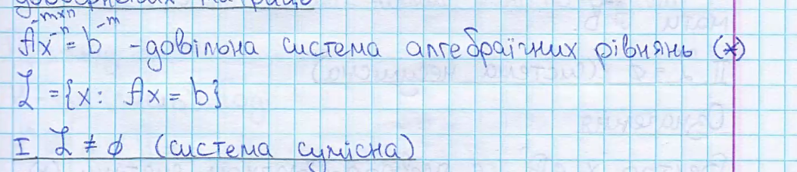

## Теорема 1
Система сумістна тоді і тільки тоді, коли 
А * А + * b = b

## Теорема 2

## Теорема 3
Нехай система сумісна, тоді множина всіх розв'язків системи:
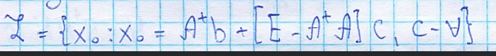

## Означення
## Псевдорозв'язок

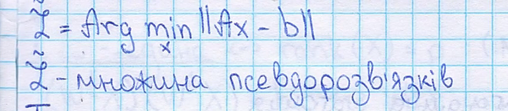

## Теорема 4

## Наслідки 
1. Множина псевдорозв'язків не порожня.
2. 

## Приклад 1
Якщо матриця Н - квадратна та невироджена, тоді Н+ = Н^-1

## Приклад 2
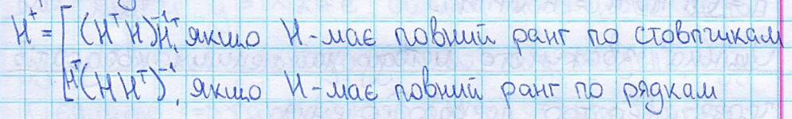

## Приклад 3
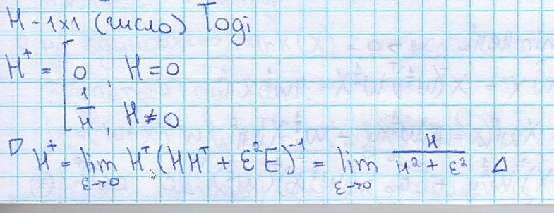

## Приклад 4
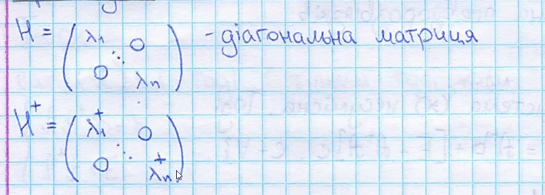

## Приклад 5
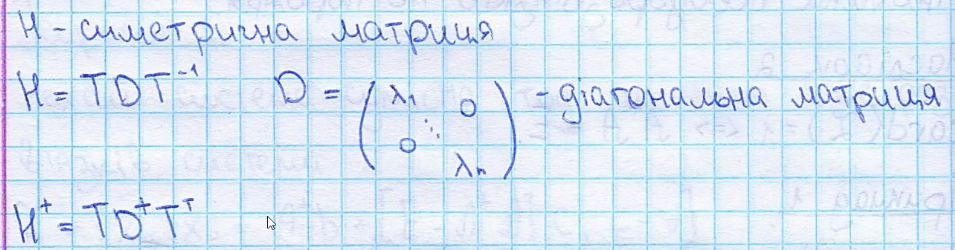

## Приклад 6
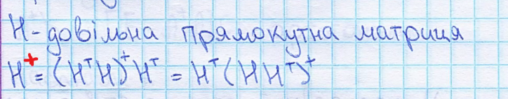
