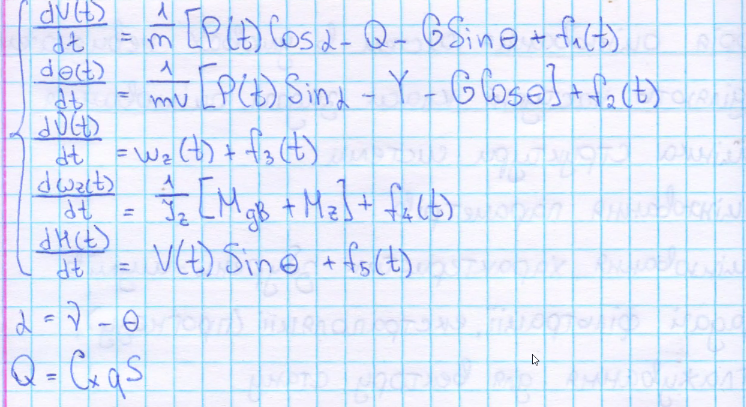

# Теорія оцінювання систем в умовах невизначенності
----------

## Виділяють наступні класи задачі оцінювання:
1. оцінка структури системи (об'єкту)
2. оцінювання невідомих параметрів моделі об'єкту
3. оцінювання характеристик збурень (шумів)
4. задачі фільтрації, електрополяції (прогнозу), зглажування для вектору стану

## В якості математичної моделі вискористовують:
1. системи алгебраїчних рівнянь (для статичних систем)
2. системи диференційних рівнянь (для опису динамічних систем)
3. системи рівнянь в частинних похідних
4. системи інтегральних рівнянь
5. різні варінти комбінацій цих пунктів

### Приклад 1 (задача оцінки параметрів повздовжнього руху літального апарату)

Маэмо систему диференційних рівнянь п'ятого порядку

v(t) швидкість
\theta(t) - кут нахилу горизонту
ню(t)кут тангажа
омега_z(t) - швидкість звіни кута тангажа
P(t) - тяга двигуна
S - площа крил
Н(t) - висота літального апарата
m - маса літального апарата
G - вага літального апарата
Q - лобовий опір
Y - підйомна сила
J_z - момент інерції
M_z = m_z*q*S*B_a - повздовжний аеродинамічний момент
M_дв - повздовжний аеродинамічний моментщо створюється двигунами
