# Теорія оцінювання систем в умовах невизначенності
----------

## Виділяють наступні класи задачі оцінювання:
1. оцінка структури системи (об'єкту)
2. оцінювання невідомих параметрів моделі об'єкту
3. оцінювання характеристик збурень (шумів)
4. задачі фільтрації, електрополяції (прогнозу), зглажування для вектору стану

## В якості математичної моделі вискористовують:
1. системи алгебраїчних рівнянь (для статичних систем)
2. системи диференційних рівнянь (для опису динамічних систем)
3. системи рівнянь в частинних похідних
4. системи інтегральних рівнянь
5. різні варінти комбінацій цих пунктів

### Приклад 1 (задача оцінки параметрів повздовжнього руху літального апарату)
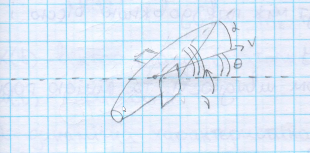
Маэмо систему диференційних рівнянь п'ятого порядку
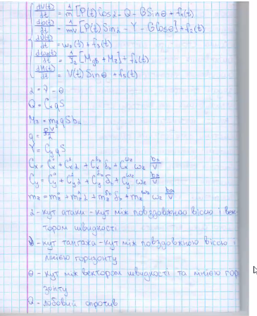
  v(t) швидкість
  \theta(t) - кут нахилу горизонту
  ню(t)кут тангажа
  омега_z(t) - швидкість звіни кута тангажа
  P(t) - тяга двигуна
  S - площа крил
  q - швидкісний напір
  ро - щільність повітря
  b_a - коренева форма крила
  Н(t) - висота літального апарата
  m - маса літального апарата
  G - вага літального апарата
  Q - лобовий опір
  Y - підйомна сила
  J_z - момент інерції
  M_z = m_z*q*S*B_a - повздовжний аеродинамічний момент
  M_дв - повздовжний аеродинамічний моментщо створюється двигунами
  f_i(t) - збурення
  Всього 12 постійних невідомих параметрів, а також визначити характеристики збурень
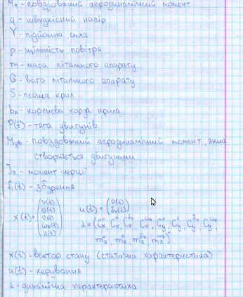

__Задача оцінювання (ідентифікаціїї)__ - це проблема визначення або уточнення статичних або динамічних характеристик системи по інформації апріорній та яка надходить з каналу спостережень (приклад динамічна характеристика - ветор станів, приклад статичних характеристик - вектор постійних невідомих параметрів).

Якщо апріорна інформація бідна або відсутня, то маємо справу з задачею ідентифікації в широкому розумінні, якщо інформація відома з точністю до невідомих параметрів, то маємо справу з задачею ідентифікації в узькому розумінні.

### Приклад 2 -- задача про тренажер літального апарату

## Основні класи математичних моделей
1. 
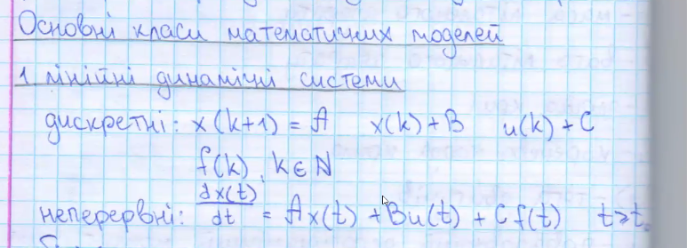
2.
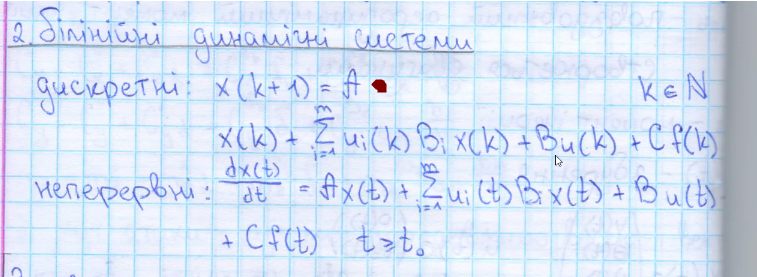
3.
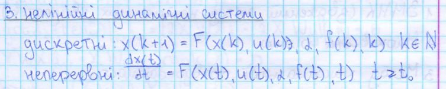

### Означення 
__Тензорний добуток матриць__ - нехай А -матриця (mxn) В - матриця (pxq), тоді
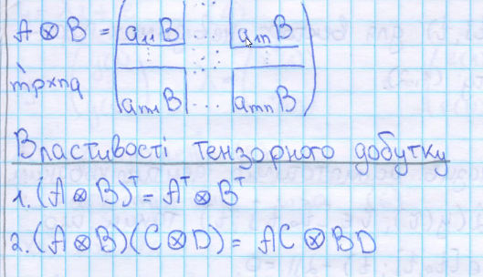

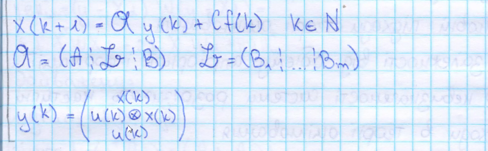

## Постановка задачі оцінювання параметрів
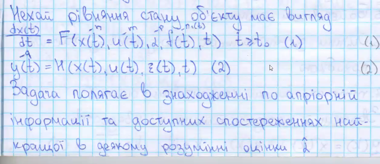
  (1) - рівняння стану
    (2) - рівняння каналу спостережень (рівняння спостережень)
  x(t) - вектор фазовмх станів
    u(t) - ветор спостережень
  ксі(t) - вектор похибок каналу спостережень
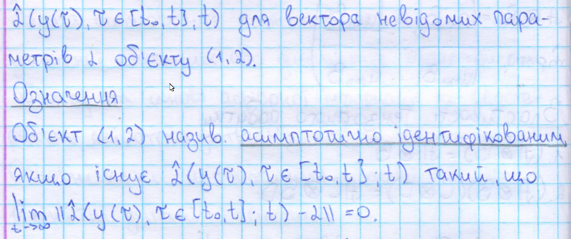

### Означення 
Об'єкт <1,2> називається __асимптотично ідентифікованим__ , якщо
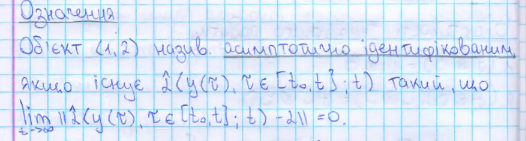

Об'єкт <1,2> називається __точно ідентифікованим__, якoо існує таке T, що
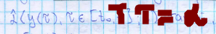
